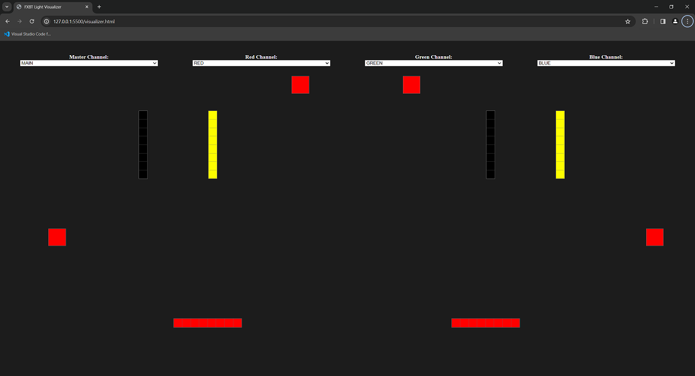

# JS Light Visualizer

## What is it?

This utility is a quick browser based app I threw together over the span of a few hours.
The idea is to visualize a light show used by a band I've worked with during their live performances.
These lights are controlled by MIDI data sent from another application.
During a show, this MIDI data is typically read by a program which can convert the MIDI signal to a DMX signal, which is then sent out via USB
to the hardware devices. This tool instead reads the MIDI data and lights up boxes on the page, which are placed
appoximately in line with where the real lights would sit on a stage.
This allows for quick iterations when building the show without the need to drag out a bunch of hardware and
cables to physically set the equipment up in a room.

## How does it work?

`visualizer.html` displays, essentially, a top-down stage plot, with each box on screen corresponding to the rough
placement of a light in use by the show.

Across the top of the page are four dropdown boxes which display any MIDI-capable devices currently attached to the PC.
The DMX software we were using, called "QLC+", could allow input for up to 4 MIDI devices simultaneously, which corresponds to these 4 text boxes.

The app will listen for events from any selected MIDI device, and light up these boxes either red, green, or blue, according to the MIDI note data
recieved. These note numbers are hard-coded and match what QLC+ would be expecting during a genuine performance with physical hardware.

Each "light" is represented by a `
` on screen. They each get their own HTML id, along with a CSS class for the more complicated
strip lights. The strip lights essentially act as a light-within-a-light, where the entire bar can be controlled and treated
as a single light, or each segment of the bar can be controlled individually, depending on which MIDI channel the data is coming from.

`visualizer.js` listens for events from the 4 MIDI devices, and lights up the boxes on screen, according to the data in the MIDI event.

This application is not very flexible or customizable as is, since it was built with one very niche and specific use case in mind.
That said, it's possible to move or add additional lights by modifiying or adding `
` elements in the HTML file, and then
registering any new lights in the JS file by adding a new element to the `lights` array, along with the relevant MIDI note numbers
associated with any new lights.

